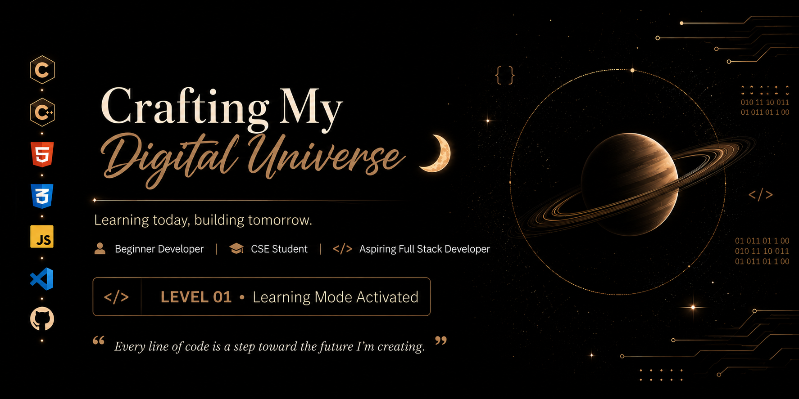
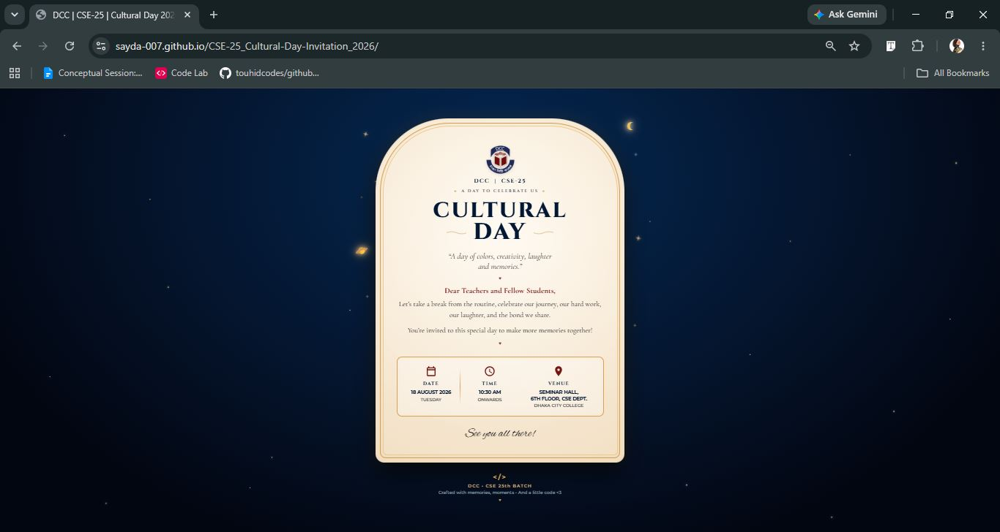

  

# 🦋 Hello there! Nice to see you!

### 🌱 Aspiring Full-Stack Developer | Learning, Building & Growing

I'm an aspiring web developer currently building my foundation in **JavaScript** and improving my problem-solving skills through practice and projects.

My journey started with **HTML and CSS**, where I learned how to structure and design websites. I've now moved into **JavaScript**, focusing on understanding the fundamentals, writing logic, and becoming more confident at solving problems.

### 💻 What I'm Learning

- 🟠 **JavaScript** — Fundamentals & Problem Solving
- 🟦 **TypeScript** — Introduction / Will revisit
- 🎨 **HTML & CSS** — Building responsive and modern interfaces
- 🐙 **Git & GitHub** — Version control and project management
- 🟢 **Node.js** — Exploring the JavaScript ecosystem

### 🚀 My Goal

My goal is to become a **professional full-stack web developer** by learning consistently, building real projects, solving problems.
I'm still at the beginning of my journey, but I'm enjoying every step of it. 💫

> **Learn → Practice → Build → Make mistakes → Fix them → Grow.** 🚀

### 📌 Currently

**Focused on JavaScript • Building projects • Strengthening fundamentals • One step at a time**

### 🌐 Socials:

 

 

# 💻 Tech Stack:

 

 

## ⭐ Featured Projects

<table>
<tr>

<td width="50%">

### 🎤 DEVCONF 2026

**A modern developer conference website built with HTML and CSS.**

🌐 [Live Page](https://sayda-007.github.io/B14-A01-DevConf-2026-main/)

💻 [GitHub Repository](https://github.com/sayda-007/B14-A01-DevConf-2026-main)

</td>

<td width="50%">

### 🎉 Cultural Day Invitation 2026

**A responsive digital invitation created with HTML and CSS.**

🌐 [Live Page](https://sayda-007.github.io/CSE-25_Cultural-Day-Invitation_2026/)

💻 [GitHub Repository](https://github.com/sayda-007/CSE-25_Cultural-Day-Invitation_2026)

</td>

</tr>
</table>

# 📊 GitHub Stats:
 
 

### ✍️ Random Dev Quote

---
## 🌙 Thanks for visiting my profile <3
