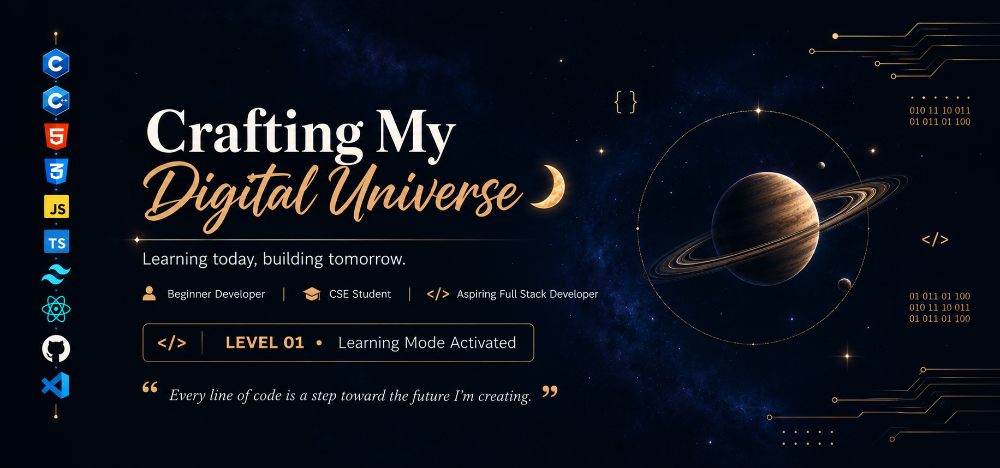

  

# 🦋 Hello there! Nice to see you!

### 🌱 Aspiring Full-Stack Developer | Learning, Building & Growing

I'm an aspiring Web Developer currently building my foundation in **React** and continuously improving my problem-solving skills through practice and projects.

My journey started with **HTML and CSS**, where I learned the fundamentals of structuring and styling websites. I then moved on to **JavaScript**, where I built my programming fundamentals, learned to think logically, and practiced solving problems — something I'm still actively working on.

After JavaScript, I explored **TypeScript** to strengthen my understanding of typed JavaScript. I'm still learning and improving my TypeScript skills. I also learned **Tailwind CSS** to make building modern, responsive interfaces more efficient.

Now, I'm focusing on **React**, strengthening my frontend development skills and learning how to build interactive, component-based web applications.

### 💻 What I'm Learning

- 🔶 **React**  — Building foundation
- 🟦 **TypeScript** — Introduction / Will revisit
- 🟠 **JavaScript** — Fundamentals & Problem Solving
- 🎨 **HTML & CSS** — Building responsive and modern interfaces
- 🐙 **Git & GitHub** — Version control and project management
- 🟢 **Node.js** — Exploring the JavaScript ecosystem

### 🚀 My Goal

My goal is to become a **Professional Full-Stack Web Developer** by learning consistently, building real projects, solving problems.
I'm still at the beginning of my journey, but I'm enjoying every step of it. 💫

> **Learn → Practice → Build → Make mistakes → Fix them → Grow.** 🚀

### 📌 Currently

**Focused on React • Building projects • Strengthening fundamentals • One step at a time**

### 🌐 Socials:

 

 

# 💻 Tech Stack:

 

![LinkedIn](https://img.shields.io/badge/LinkedIn-0077b5?logo=data:image/svg+xml;base64,PHN2ZyB3aWR0aD0nMjU2JyBoZWlnaHQ9JzI1NicgeG1sbnM9J2h0dHA6Ly93d3cudzMub3JnLzIwMDAvc3ZnJyBwcmVzZXJ2ZUFzcGVjdFJhdGlvPSd4TWlkWU1pZCcgdmlld0JveD0nMCAwIDI1NiAyNTYnPjxwYXRoIGQ9J00yMTguMTIzIDIxOC4xMjdoLTM3LjkzMXYtNTkuNDAzYzAtMTQuMTY1LS4yNTMtMzIuNC0xOS43MjgtMzIuNC0xOS43NTYgMC0yMi43NzkgMTUuNDM0LTIyLjc3OSAzMS4zNjl2NjAuNDNoLTM3LjkzVjk1Ljk2N2gzNi40MTN2MTYuNjk0aC41MWEzOS45MDcgMzkuOTA3IDAgMCAxIDM1LjkyOC0xOS43MzNjMzguNDQ1IDAgNDUuNTMzIDI1LjI4OCA0NS41MzMgNTguMTg2bC0uMDE2IDY3LjAxM1pNNTYuOTU1IDc5LjI3Yy0xMi4xNTcuMDAyLTIyLjAxNC05Ljg1Mi0yMi4wMTYtMjIuMDA5LS4wMDItMTIuMTU3IDkuODUxLTIyLjAxNCAyMi4wMDgtMjIuMDE2IDEyLjE1Ny0uMDAzIDIyLjAxNCA5Ljg1MSAyMi4wMTYgMjIuMDA4QTIyLjAxMyAyMi4wMTMgMCAwIDEgNTYuOTU1IDc5LjI3bTE4Ljk2NiAxMzguODU4SDM3Ljk1Vjk1Ljk2N2gzNy45N3YxMjIuMTZaTTIzNy4wMzMuMDE4SDE4Ljg5QzguNTgtLjA5OC4xMjUgOC4xNjEtLjAwMSAxOC40NzF2MjE5LjA1M2MuMTIyIDEwLjMxNSA4LjU3NiAxOC41ODIgMTguODkgMTguNDc0aDIxOC4xNDRjMTAuMzM2LjEyOCAxOC44MjMtOC4xMzkgMTguOTY2LTE4LjQ3NFYxOC40NTRjLS4xNDctMTAuMzMtOC42MzUtMTguNTg4LTE4Ljk2Ni0xOC40NTMnIGZpbGw9JyNmZmYnLz48L3N2Zz4K)

 

## ⭐ Featured Projects

<table>
<tr>

<td width="50%">

### 🎤 DEVCONF 2026

**A modern developer conference website built with HTML and CSS.**

🌐 [Live Page](https://sayda-007.github.io/B14-A01-DevConf-2026-main/)

💻 [GitHub Repository](https://github.com/sayda-007/B14-A01-DevConf-2026-main)

</td>

<td width="50%">

### 🎉 Cultural Day Invitation 2026

**A responsive digital invitation created with HTML and CSS.**

🌐 [Live Page](https://sayda-007.github.io/CSE-25_Cultural-Day-Invitation_2026/)

💻 [GitHub Repository](https://github.com/sayda-007/CSE-25_Cultural-Day-Invitation_2026)

</td>

</tr>
</table>

# 📊 GitHub Stats:
 
 

### ✍️ Random Dev Quote

## 🐍 My GitHub Contribution Snake

---
## 🌙 Thanks for visiting my profile <3
